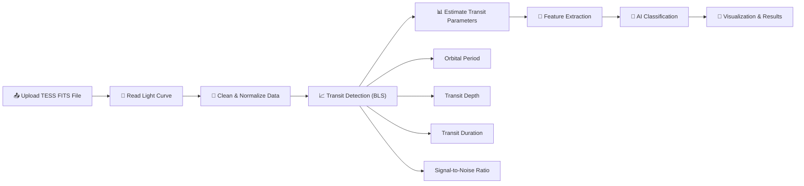
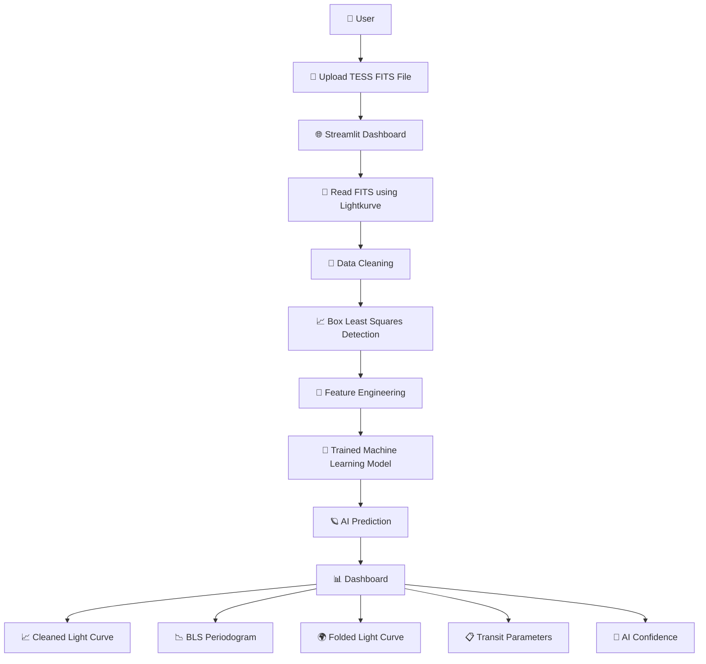
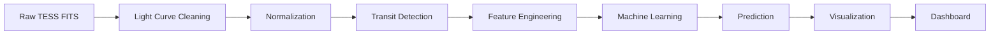
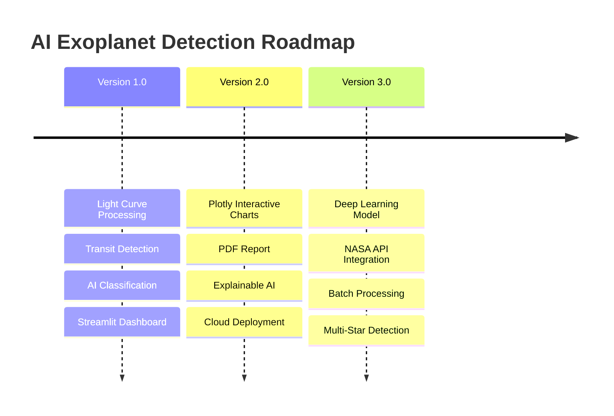

# 🌌 AI-Based Exoplanet Transit Detection System

<p align="center">

<a href="https://ai-exoplanet-transit-detection-dnjky7cwx8x6tup7zvre6v.streamlit.app/">
  
</a>


</p>

## 🚀 Live Demo

🌐 **Experience the application live without installing anything.**

👉 **Live Application:** **https://YOUR-APP.streamlit.app**

The application is successfully deployed on **Streamlit Community Cloud** and allows users to upload astronomical **FITS** files, visualize stellar light curves, and perform AI-powered exoplanet transit detection directly in the browser.

<p align="center">


</p>

<p align="center">

# 🛰 Detecting Exoplanets from TESS Light Curves using Artificial Intelligence

### A Machine Learning Pipeline for Automatic Transit Detection from Noisy Astronomical Data

</p>

---

# 🌟 Overview

Detecting exoplanets through transit photometry requires identifying extremely small changes in stellar brightness. These signals are often hidden by detector noise, stellar variability, and observational artifacts.

This project provides a complete AI-powered pipeline that automatically:

* 📂 Reads NASA TESS FITS files
* 🧹 Cleans noisy light curve data
* 📈 Detects transit signals using the Box Least Squares (BLS) algorithm
* 📊 Estimates orbital parameters
* 🧠 Extracts machine learning features
* 🤖 Classifies potential exoplanet candidates
* 📸 Visualizes the complete detection process through an interactive Streamlit dashboard

---

# ✨ Key Features

* 🌌 Interactive Streamlit Dashboard
* 📂 Upload TESS FITS files directly
* 🧹 Automatic Light Curve Cleaning
* 📈 Transit Detection using BLS
* 📊 Orbital Parameter Estimation
* 🧠 AI-Based Transit Classification
* 📉 Phase Folded Light Curve
* 📈 Interactive Transit Visualizations
* 📋 Feature Engineering Pipeline
* ⚡ Fast Real-Time Predictions

---

# 🎯 Project Goals

✔ Detect transit-like events from noisy TESS observations

✔ Automatically estimate transit characteristics

✔ Apply Machine Learning for candidate classification

✔ Provide an intuitive interface for astronomical analysis

✔ Demonstrate an end-to-end AI workflow combining astronomy and data science

---

# 🛰 Pipeline Workflow



---

# 🏗 System Architecture



---

# 📊 Machine Learning Pipeline

```text
TESS FITS Data
        │
        ▼
Read Light Curve
        │
        ▼
Remove Missing Values
        │
        ▼
Flatten & Normalize
        │
        ▼
BLS Transit Detection
        │
        ▼
Estimate Parameters
        │
        ▼
Feature Engineering
        │
        ▼
Machine Learning Model
        │
        ▼
Prediction
        │
        ▼
Interactive Dashboard
```

---

# 📸 Application Preview

## 📤 Upload FITS File

<p align="center">

</p>

---

## 🧹 Cleaned Light Curve

<p align="center">

</p>

---

## 📈 Transit Detection (BLS)

<p align="center">

</p>

---

## 📊 Estimated Transit Parameters

<p align="center">

</p>

---

## 🌍 Phase Folded Light Curve

<p align="center">

</p>

---

## 🤖 AI Classification

<p align="center">

</p>

---

# 📂 Project Structure

```text
AI-Exoplanet-Transit-Detection/
│
├── 📁 src/
│   ├── 01_read_lightcurve.py
│   ├── 02_clean_lightcurve.py
│   ├── 03_detect_transit.py
│   ├── 04_extract_features.py
│   ├── 05_train_model.py
│   ├── 06_predict.py
│   ├── 07_catalog_analysis.py
│   ├── 08_match_catalogs.py
│   ├── 09_match_tce_catalog.py
│   ├── 10_train_tce_model.py
│   ├── 11_feature_importance.py
│   ├── 12_advanced_features.py
│   └── 13_train_advanced_model.py
│
├── 📁 Data/
│   ├── Fits/
│   └── Catalogs/
│
├── 📁 Outputs/
│
├── 📁 images/
│
├── 🌐 app.py
├── 📄 requirements.txt
├── 📘 README.md
└── 📜 LICENSE
```

---

# ⚙️ Installation

## 1️⃣ Clone the Repository

```bash
git clone https://github.com/rawat4113/AI-Exoplanet-Transit-Detection.git

cd AI-Exoplanet-Transit-Detection
```

---

## 2️⃣ Create Virtual Environment (Recommended)

### Windows

```bash
python -m venv venv
venv\Scripts\activate
```

### Linux / macOS

```bash
python3 -m venv venv
source venv/bin/activate
```

---

## 3️⃣ Install Dependencies

```bash
pip install -r requirements.txt
```

---

# 📦 Required Python Packages

```text
streamlit
numpy
pandas
matplotlib
scipy
lightkurve
astropy
scikit-learn
joblib
plotly
```

---

# 🚀 Running the Application

Launch the Streamlit dashboard:

```bash
streamlit run app.py
```

The application will automatically open in your browser.

---

# 📥 Dataset

This project uses **NASA TESS (Transiting Exoplanet Survey Satellite)** light curve data.

Due to GitHub file size limits, the complete dataset is **not included** in this repository.

Create the following folders before running the project:

```text
Data/
├── Fits/
└── Catalogs/
```

Place your downloaded `.fits` files inside:

```text
Data/Fits/
```

---

# 📊 Feature Engineering

The AI model extracts multiple astrophysical and statistical features from each light curve:

| Feature                     | Description                                |
| --------------------------- | ------------------------------------------ |
| Orbital Period              | Estimated transit period from BLS          |
| Transit Depth               | Relative decrease in stellar brightness    |
| Transit Duration            | Duration of the transit event              |
| Maximum BLS Power           | Strength of the detected periodic signal   |
| Signal-to-Noise Ratio (SNR) | Signal quality estimate                    |
| Number of Transits          | Estimated transit occurrences              |
| Mean Flux                   | Average normalized stellar flux            |
| Flux Standard Deviation     | Statistical variability of the light curve |

---

# 🤖 Machine Learning Model

The classifier predicts whether a detected signal is likely to be a genuine exoplanet transit.

### Workflow

```text
Light Curve
      │
      ▼
Feature Extraction
      │
      ▼
Machine Learning Model
      │
      ▼
Probability Prediction
      │
      ▼
Transit / Non-Transit
```

The prediction is accompanied by an **AI confidence score**, allowing users to assess the reliability of each classification.

---

# 📊 Dashboard Features

The Streamlit dashboard includes:

* 📂 FITS file upload
* 🧹 Automatic preprocessing
* 📈 Cleaned light curve visualization
* 📉 BLS periodogram
* 🌍 Phase-folded light curve
* 📋 Estimated transit parameters
* 🤖 AI-based classification
* 🎯 Confidence score
* 📊 Interactive tables
* 📱 Responsive interface

---

# 🛠 Technologies Used

| Category            | Technologies        |
| ------------------- | ------------------- |
| Programming         | Python              |
| Web Framework       | Streamlit           |
| Astronomy           | Lightkurve, Astropy |
| Machine Learning    | Scikit-learn        |
| Data Processing     | Pandas, NumPy       |
| Visualization       | Matplotlib, Plotly  |
| Model Serialization | Joblib              |
| Version Control     | Git & GitHub        |

---

# 🔬 Scientific Workflow


---

# 📈 Results

The developed pipeline successfully performs end-to-end exoplanet transit detection using TESS light curve data.

### Output Generated

* ✅ Cleaned Light Curve
* ✅ Box Least Squares (BLS) Periodogram
* ✅ Estimated Transit Parameters
* ✅ Phase Folded Light Curve
* ✅ AI Classification
* ✅ Confidence Score

---

# 📊 Sample Output

| Parameter             | Example                      |
| --------------------- | ---------------------------- |
| Orbital Period        | 3.57 Days                    |
| Transit Depth         | 0.0023                       |
| Transit Duration      | 0.14 Days                    |
| Signal-to-Noise Ratio | 18.42                        |
| AI Confidence         | 96.87%                       |
| Prediction            | Possible Exoplanet Candidate |

---

# 🎯 Applications

This project can be used for:

* 🌌 Exoplanet Candidate Detection
* 🔭 Astronomical Research
* 🛰️ Space Science Education
* 🤖 AI & Machine Learning Demonstration
* 📚 Data Science Portfolio
* 🎓 Academic Projects
* 🚀 Hackathons
* 💼 AI Internship Portfolio

---

# 🚀 Future Improvements (Version 2.0)

Planned enhancements include:

* 🌠 Interactive Plotly Charts
* 🌍 Dark / Light Theme
* 📄 PDF Report Generation
* 📊 Download Results as CSV
* 🤖 Explainable AI (Feature Importance)
* 🌌 NASA APOD Integration
* 🛰️ Multi-star Batch Processing
* ☁️ Streamlit Cloud Deployment
* 📈 Advanced Deep Learning Models
* 🌍 Mobile-Friendly Dashboard
* 🔔 Real-Time Processing Status
* 📡 Automatic Dataset Downloader

---

# 📚 Learning Outcomes

This project demonstrates practical experience in:

* Machine Learning
* Artificial Intelligence
* Data Science
* Feature Engineering
* Astronomy Data Analysis
* Signal Processing
* Time Series Analysis
* Scientific Python
* Streamlit Web Development
* Git & GitHub
* Open Source Project Development

---

# 🛣️ Roadmap



---

# 🤝 Contributing

Contributions are welcome!

If you have ideas for improvements, new features, or bug fixes:

1. Fork this repository
2. Create a feature branch
3. Commit your changes
4. Push to your branch
5. Open a Pull Request

---

# 📝 License

This project is distributed under the **MIT License**.

You are free to:

* ✅ Use
* ✅ Modify
* ✅ Distribute
* ✅ Build upon

Please retain the original license notice.

---

# 👨‍💻 Author

## Ritesh Rawat

**B.Tech Information Technology Student**

Passionate about:

* 🤖 Artificial Intelligence
* 📊 Data Science
* 🧠 Machine Learning
* 🌌 Space AI
* 📈 Data Analytics

---

## 📫 Connect with Me

* GitHub: https://github.com/rawat4113
* LinkedIn: https://www.linkedin.com/in/ritesh-rawat-it
* Email: rawatritesh197@gmail.com
---

# ⭐ Support the Project

If you found this project useful:

⭐ Star this repository

🍴 Fork the project

📝 Share your feedback

🤝 Contribute improvements

Your support helps improve the project and motivates future development.

---

<p align="center">

## 🌌 "Exploring the Universe with Artificial Intelligence"

### ⭐ If you like this project, don't forget to give it a Star!

**Made with ❤️ using Python, Machine Learning, Streamlit, and TESS Astronomical Data**

</p>
