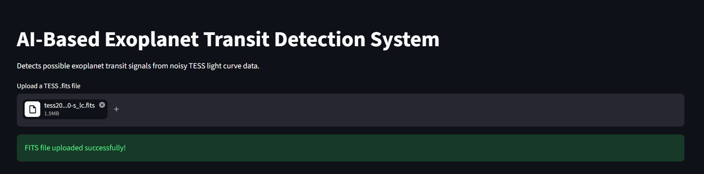
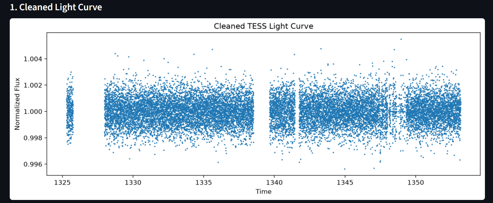
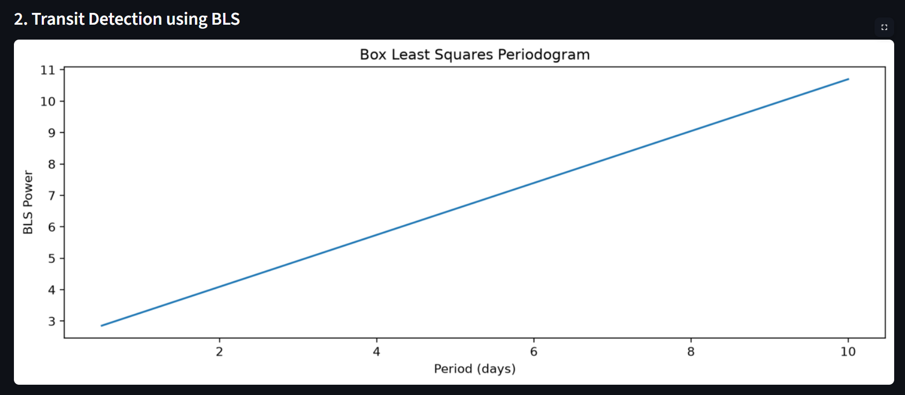
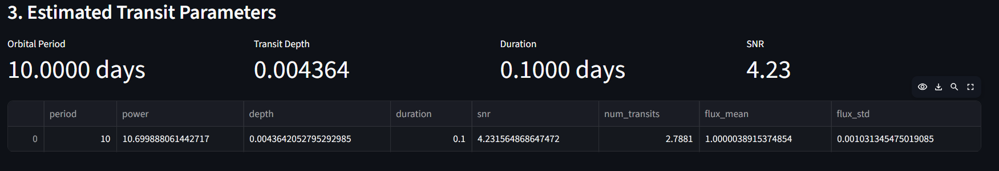
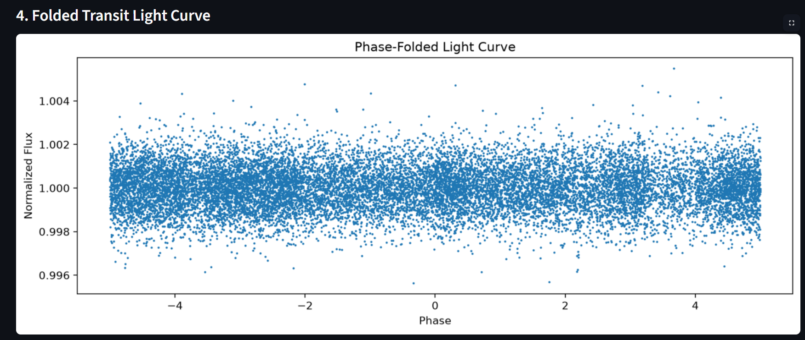
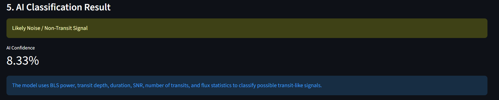

# 🌌 AI-Exoplanet-Transit-Detection

> **An AI-powered end-to-end pipeline for detecting exoplanet transit signals from noisy TESS light curve data using feature engineering, Box Least Squares (BLS), and Machine Learning.**


---

# 🚀 Overview

Detecting exoplanets from stellar light curves is challenging because transit signals are extremely small and often hidden by instrumental noise and stellar variability.

This project implements a complete AI-powered pipeline that:

* Reads NASA TESS `.fits` files
* Cleans noisy light curve data
* Detects possible transit signals using Box Least Squares (BLS)
* Estimates orbital parameters
* Extracts astrophysical features
* Uses Machine Learning to classify potential exoplanet candidates
* Visualizes every stage of the detection pipeline

---

# ✨ Features

* 📂 Upload TESS FITS files
* 🧹 Automatic light curve cleaning
* 📈 Transit detection using Box Least Squares (BLS)
* 🌍 Estimate orbital period, transit depth and duration
* 📊 Phase-folded light curve visualization
* 🤖 AI-based transit classification
* 📉 Interactive plots and statistical summaries
* 🌐 Streamlit web interface

---

# 🛰️ Pipeline Workflow

```text
Upload FITS File
        │
        ▼
Read Light Curve
        │
        ▼
Clean & Normalize Data
        │
        ▼
Detect Transit (BLS)
        │
        ▼
Estimate Parameters
        │
        ▼
Extract Features
        │
        ▼
AI Classification
        │
        ▼
Visualization & Results
```

---

# 📸 Application Preview

## 📤 Upload FITS File

<p align="center">
  
</p>

---

## 🧹 Cleaned Light Curve

<p align="center">
  
</p>

---

## 📈 Transit Detection (BLS)

<p align="center">
  
</p>

---

## 📊 Estimated Transit Parameters

<p align="center">
  
</p>

---

## 🌌 Phase Folded Light Curve

<p align="center">
  
</p>

---

## 🤖 AI Classification Result

<p align="center">
  
</p>

# 📂 Project Structure

```text
AI-Exoplanet-Transit-Detection/
│
├── Data/
│   └── Catalogs/
│
├── Outputs/
├── Plots/
│
├── app.py
├── 01_read_lightcurve.py
├── 02_clean_lightcurve.py
├── 03_detect_transit.py
├── 04_extract_features.py
├── 05_train_model.py
├── 06_predict.py
├── 07_catalog_analysis.py
├── 08_match_catalogs.py
├── 09_match_tce_catalog.py
├── 10_train_tce_model.py
├── 11_feature_importance.py
├── 12_advanced_features.py
├── 13_train_advanced_model.py
│
├── requirements.txt
├── README.md
└── LICENSE
```

---

# 🛠 Technologies Used

| Category         | Tools               |
| ---------------- | ------------------- |
| Language         | Python              |
| Astronomy        | Astropy, Lightkurve |
| Data Analysis    | NumPy, Pandas       |
| Machine Learning | Scikit-learn        |
| Visualization    | Matplotlib          |
| Web App          | Streamlit           |

---

# 📊 AI Model

The model uses engineered features including:

* Transit Period
* Transit Depth
* Transit Duration
* Signal-to-Noise Ratio (SNR)
* Number of Detected Transits
* Flux Mean
* Flux Standard Deviation

These features are used to classify whether the detected signal is likely to be a genuine exoplanet transit or noise.

---

# ⚙️ Installation

```bash
git clone https://github.com/rawat4113/AI-Exoplanet-Transit-Detection.git

cd AI-Exoplanet-Transit-Detection

pip install -r requirements.txt
```

---

# ▶️ Run

```bash
streamlit run app.py
```

Open:

```
http://localhost:8501
```

---

# 📈 Current Capabilities

* Read TESS FITS observations
* Detect periodic transit signals
* Estimate orbital parameters
* AI classification
* Interactive visualizations

---

# 🚀 Future Improvements

* Deep Learning (CNN/LSTM) based classifier
* Multi-sector TESS support
* NASA Exoplanet Archive integration
* Confidence calibration
* Explainable AI (SHAP)
* Cloud deployment

---

# 👨‍💻 Author

**Ritesh Rawat**

B.Tech Information Technology

Aspiring Data Scientist & AI/ML Engineer

---

# 📜 License

This project is licensed under the MIT License.

